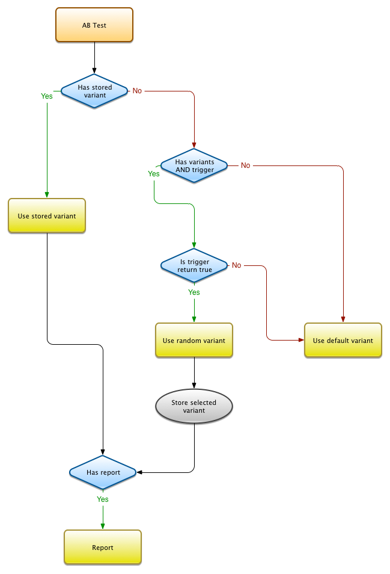

# ABTest  [](https://scrutinizer-ci.com/g/Phoenix-Corp/ABTest/?branch=master)

## Définition

Un test AB, AZ, ou multivarié est une technique de tests permettant dans un contexte unique de présenter et mesurer plusieurs variations afin d'isoler la variation la plus performante.

## Instanciation

La façon la plus simple d'instancier un test est d'instancier la classe Test dans le namespace AB, en lui attribuant un nom :

```
$myTest = new AB\Test('Simple test');
```

Le test est dorénavant prêt. Il ne reste plus qu'à l'executer à l'endroit où l'on veut l'utiliser gràce à un simple echo :

```
echo $myTest;
```

Dans cet exemple, il ne se passe évidemment rien. Il faut fournir quelques variations, ou tout du moins une variation par defaut sous forme de [closure](http://fr2.php.net/manual/fr/functions.anonymous.php) :

```
$myTest = new AB\Test('Simple test');

$myTest->addDefaultVariant(function(){

    echo sprintf('<h1>%s</h1>', 'Default title');

});

echo $myTest;
```

La variation par defaut peut aussi être fournie à l'objet Ab\Test lors de son instanciation :

```
$myTest = new AB\Test('Simple test', function(){

    echo sprintf('<h1>%s</h1>', 'Default title');

});

echo $myTest;
```

Le test précédent affichera donc en toutes circonstances le code suivant :

`<h1>Default title</h1>`

## Variations

Pour ajouter des variations à un test, il suffit d'utiliser la méthode idoine :

```
$myTest->addVariant('variant number one', function(){

    echo sprintf('<h1>%s</h1>', 'Fancy variant');

});
```

Cette méthode retourne un objet AB\Variant sur lequel on peut attribuer des poids afin d'affiner les chances de voir telle ou telle variation être testée :

```
$variant = $myTest->addVariant('variant number one', function(){

    echo sprintf('<h1>%s</h1>', 'Fancy variant');

});

$variant->withWeight(8);
```

Il est tout à fait possible de chainer ces appels pour une meilleure lisibilité du code :

```
$myTest->addVariant('variant number one', function(){

    echo sprintf('<h1>%s</h1>', 'Fancy variant');

})->withWeight(8);
```

Il est possible d'ajouter autant de variations que souhaité. Elles seront selectionnées aléatoirement en fonction du poids qui leur aura été attribué (ou pas) :

```
$myTest->addVariant('variant number one', function(){

    echo sprintf('<h1>%s</h1>', 'Fancy variant');

})->withWeight(8);

$myTest->addVariant('second variant', function(){

    echo sprintf('<h1>%s</h1>', 'Nice variant');

});

$myTest->addVariant('variant #3', function(){

    echo sprintf('<h1>%s</h1>', 'Bright variant');

})->withWeight(5);
```

## Déclencheurs

Dans certains cas, il est préférable de conditionner l'execution d'un test AB à un contexte particulier. C'est ce que permet la méthode `setTrigger` : Cette méthode reçoit une fonction en argument. Cette fonction doit retourner un booléen qui correspond en fait à l'état du déclencheur :
S'il renvoie `false`, le déclencheur utilisera la variation par défaut.
Si au contraire le déclencheur retourne `true`, l'une des variations sera sélectionnée au hasard et en fonction des poids définis.

Par exemple, ne déclenchons notre Test AB que l'après-midi :

```
$myTest->setTrigger(function(){

    $date = new DateTime();
    return ( $date->format('H') > 12 );

});
```

## Résultats

Sans analyse des résultats, un test multivarié n'a que peu de sens.
Afin que n'importe quelle donnée puisse être traitée, la classe AB\Test fourni une méthode `setReport` qui, à la manière du déclencheur, reçoit une fonction en tant qu'argument. Cette fonction peut, elle aussi, utiliser un argument facultatif qui se trouve être le test AB en cours. La liberté en matière de traitement de résultats du test est donc à peu près totale.

Essayons par exemple de transmettre le résultat de l'execution d'un test AB à notre server de file d'attente Beanstalkd :

```
$myTest->setReport(function ($ABTest) use ($pheanstalk) {

    $job = new stdClass();
    $job->function = 'store_ab_result';
    $job->ab_data = array(
        $name       => $ABTest->getName(),
        $variant    => $ABTest->getSelectedVariant()->getName(),
        $stamp      => time(),
        $user       => Application::getUserID()
    );
    $pheanstalk->useTube('abteststube')->put($job);

});
```

## Diagramme de flux

Pour résumer, le fux de travail du test AB est le suivant :

